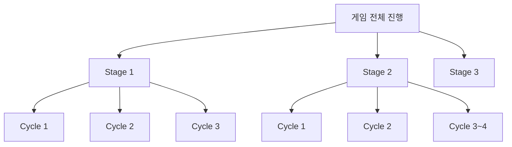

# 맵 설계 워크플로우

이 폴더는 `Pixel Guard: Wave`의 맵을 우리 둘이 같이 손으로 설계하기 위한 기준 문서 묶음이다.

앞으로 이 폴더에서는 지금 실제 게임에서 쓰는 용어만 사용한다.

## 용어 기준

- `Stage`
  - 맵이 바뀌는 실제 전투 단위
  - 스테이지를 클리어하면 다음 스테이지로 넘어가며 난이도가 올라간다
- `Cycle`
  - 한 스테이지 안에 들어 있는 웨이브 묶음
  - 실질적으로 `Wave`와 같은 개념으로 다룬다
  - 현재 기준으로 한 스테이지에 보통 `3~4 Cycle`이 들어간다
- `맵 카드`
  - 스테이지 하나를 설계할 때 쓰는 설계 시트

사용하지 않는 용어:

- `Act`
- `Siege`

## 구조 한눈에 보기

## 이 게임에서 맵이 중요한 이유

이 게임은 단순히 적 체력과 공격력만 올리는 방식보다, `맵 구조가 플레이를 바꾸는 방식`이 훨씬 중요하다.

핵심은 다음 4가지다.

- 성 위치가 바뀌면 수비 습관이 바뀐다
- 적 스폰 방향과 순서가 바뀌면 우선순위 판단이 바뀐다
- 장애물 배치가 바뀌면 적의 우회 동선과 킬존이 바뀐다
- Stage가 달라지면 같은 타워 조합도 강한 자리와 약한 자리가 달라진다

즉, 이 게임은 `랜덤 장애물 게임`보다 `읽을 수 있는 수작업 공성 퍼즐형 디펜스`에 더 가깝다.

## 문서 작성 원칙

- 모든 문서는 한국어로 작성한다
- 맵 설명은 말만 하지 않고, 가능하면 `mermaid`, `ASCII 좌표도`, `셀 좌표`를 함께 남긴다
- Stage 하나를 만들 때는 반드시 `맵 카드`를 만든다
- 맵 카드에는 최소한 성 위치, 스폰 방향, 장애물 역할, 추천 킬존, 실패 포인트가 들어가야 한다
- 랜덤 생성 아이디어가 있더라도 우선은 `수작업 고정 맵` 기준으로 설계한다

## 이 폴더 안 문서 역할

- [map-pillars.md](/C:/Users/min21/Desktop/flutter_grame/depense_game/docs/design-docs/map-authoring/map-pillars.md)
  - 좋은 맵이 무엇인지 정하는 기준
- [castle-and-spawn-rules.md](/C:/Users/min21/Desktop/flutter_grame/depense_game/docs/design-docs/map-authoring/castle-and-spawn-rules.md)
  - 성 위치와 적 스폰 방향을 어디까지 허용할지 정하는 문서
- [obstacle-language.md](/C:/Users/min21/Desktop/flutter_grame/depense_game/docs/design-docs/map-authoring/obstacle-language.md)
  - 장애물이 어떤 플레이를 만들고 어떤 역할을 해야 하는지 정리한 문서
- [stage-card-template.md](/C:/Users/min21/Desktop/flutter_grame/depense_game/docs/design-docs/map-authoring/stage-card-template.md)
  - 스테이지 하나를 설계할 때 복사해서 쓰는 템플릿
- [stage-1-5-map-bible.md](/C:/Users/min21/Desktop/flutter_grame/depense_game/docs/design-docs/map-authoring/stage-1-5-map-bible.md)
  - 초반 Stage 1~5의 설계 방향을 묶어둔 문서
- [stage-1-working-card.md](/C:/Users/min21/Desktop/flutter_grame/depense_game/docs/design-docs/map-authoring/stage-1-working-card.md)
  - Stage 1 실제 설계 초안
- [visual-guide.md](/C:/Users/min21/Desktop/flutter_grame/depense_game/docs/design-docs/map-authoring/visual-guide.md)
  - 구조를 그림처럼 이해하기 위한 시각 가이드

## 우리 작업 순서

1. 공통 규칙을 먼저 잠근다
2. Stage 목표를 정한다
3. 성 위치와 스폰 순서를 정한다
4. 장애물 배치와 역할을 정한다
5. 킬존, 후퇴 거점, 위험 구역을 정한다
6. Cycle 순서에 맞게 압박이 어떻게 커지는지 적는다
7. 좌표와 ASCII 도식으로 고정한다
8. 그 다음 코드 데이터로 옮긴다

## 지금 목표

지금 목표는 한 번에 30개를 다 만드는 것이 아니다.

우선순위는 아래와 같다.

- `Stage 1~5`를 수작업으로 설계한다
- 각 스테이지가 무엇을 가르치는지 분명히 한다
- 성 위치와 스폰 패턴이 달라질 때 재미가 어떻게 달라지는지 검증한다
- 이후 같은 방식으로 Stage 6 이후를 확장한다
