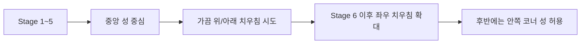

# 성 위치와 스폰 규칙

이 문서는 스테이지마다 `성 위치`와 `적 스폰 방향`을 어디까지 바꿀 수 있는지 정리한다.

## 기본 규칙

- 성 위치는 스테이지마다 달라질 수 있다
- 하지만 완전 자유 배치는 하지 않는다
- 맵 개성과 카메라 가독성을 모두 해치지 않는 승인 패턴만 사용한다

## 성 위치 패턴

### 패턴 A: 중앙 성

- 가장 기본이 되는 학습형 배치
- 초반 Stage에서 사용하기 좋다
- 사방 압박과 기본 수비 감각을 익히기 좋다

### 패턴 B: 위쪽 치우친 성

- 성이 맵 상단 쪽에 더 가까이 있다
- 아래쪽 공간이 넓어져 배치 욕심과 분산 수비가 잘 드러난다
- 아래에서 올라오는 다중 압박에 잘 어울린다

### 패턴 C: 아래쪽 치우친 성

- 성이 맵 하단 쪽에 더 가까이 있다
- 북쪽과 좌우 측면 압박이 더 위협적으로 느껴진다
- 후반 직선 압박 스테이지에 어울린다

### 패턴 D: 오른쪽 치우친 성

- 동쪽 방어 압박이 커진다
- 서쪽 긴 우회 동선과 오른쪽 짧은 압박을 동시에 만들기 좋다

### 패턴 E: 왼쪽 치우친 성

- 오른쪽 치우친 성의 반대 구조
- 좌우 비대칭 수비를 만들 때 좋다

### 패턴 F: 안쪽 코너 성

- 맵 모서리 바로 붙임이 아니라, 코너에 가까운 안쪽 요새형 배치
- 세 방향 동시 압박 같은 강한 스테이지에 어울린다
- 중간 보스 스테이지나 후반 하이라이트에 사용한다

## 성 위치 사용 권장

## 스폰 규칙

모든 Stage는 아래를 명확히 적어야 한다.

- 어느 방향에서 적이 들어오는가
- 각 Cycle에서 어떤 방향이 먼저 활성화되는가
- 메인 압박 방향과 보조 압박 방향은 어디인가
- 같은 방향 안에서도 적의 실제 등장 위치가 고정인지, `해당 변 내부 랜덤`인지

## 스폰 패턴 분류

### 패턴 1: 단일 방향 학습형

- 한 방향을 먼저 강하게 보여준다
- 다음 Cycle에서 약한 보조 방향을 추가한다
- Stage 1 같은 온보딩 구간에 적합하다

### 패턴 2: 양방향 분산형

- 두 방향이 서로 다른 길이와 속도로 압박한다
- 어느 쪽을 먼저 막아야 하는지 판단하게 만든다

### 패턴 3: 세 방향 조임형

- 세 방향이 동시에 또는 거의 동시에 압박한다
- 성 위치가 치우쳐 있을수록 재미가 커진다

### 패턴 4: 사방 압박형

- 네 방향이 모두 열린다
- 후반 난이도나 보스 직전 시험 구간용이다
- 초반에 쓸 경우 적 수치는 낮추고 우회 거리를 늘려 `바쁘지만 읽히는 난이도`로 만든다

### 패턴 5: 보스 보조 압박형

- 한 방향의 강한 적과 다른 방향의 방해 압박이 같이 온다
- 보스전이나 고난도 Stage에서 사용한다

## 체크리스트

맵 카드에는 아래가 반드시 들어가야 한다.

- 성 위치 패턴
- 스폰 패턴
- Cycle별 활성 방향
- 메인 압박 방향
- 보조 압박 방향
- 마지막 회복 거점 방향

## 실제 스폰 위치 규칙

현재 프로젝트 기준으로 `적의 실제 등장 위치`는 12시, 3시, 6시, 9시의 딱 한 점으로 고정되는 구조가 아니다.

권장 규칙:

- 전선은 `북/동/남/서 방향`으로 구분한다
- 하지만 적 개체는 같은 방향 안에서도 `그 변의 여러 위치 중 랜덤`하게 등장할 수 있다
- 다만 랜덤은 완전 자유가 아니라 `해당 방향 전선 밴드` 안에서만 움직인다

예시:

- 북쪽 전선 활성화: 북쪽 변 안에서 랜덤 등장
- 서쪽 전선 활성화: 서쪽 변 안에서 랜덤 등장

즉, `방향은 고정`, `개체 위치는 변 내부 랜덤`이 현재 게임에 맞는 규칙이다.

## 전선 화살표 규칙

방향 화살표는 `개별 적의 정확한 생성점`을 뜻하는 아이콘이 아니다.
화살표는 지금 어느 전선이 열려 있는지를 보여주는 `전선 안내 UI`다.

권장 규칙:

- 메인 화살표는 전선 방향별 대표 위치에 고정한다
- 적이 하나 생성될 때마다 화살표 위치를 계속 바꾸지 않는다
- 실제 개체 생성 위치가 필요하면 별도의 짧은 스폰 이펙트로 보조한다
- 화살표는 화면 가장자리 0px가 아니라, 전장 안쪽 안전 여백에 배치한다
- 상단 HUD와 겹치는 위치에는 놓지 않는다
