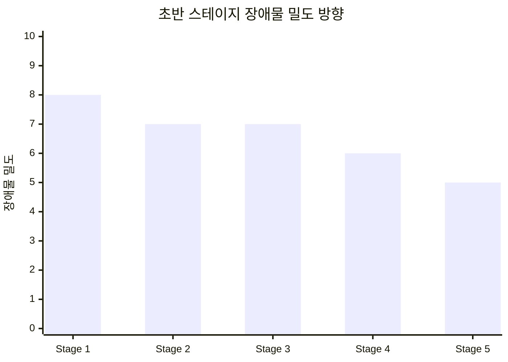

# 장애물 설계 언어

장애물은 단순 배경이 아니라 전투의 흐름을 만드는 설계 도구다.

이 문서는 장애물 종류와 역할을 공통 언어로 정리한다.

## 기본 원칙

- 장애물은 반드시 `역할`이 있어야 한다
- 플레이어가 봤을 때 왜 그 위치에 있는지 이해되어야 한다
- 장애물이 늘어날수록 적이 돌아와서 타워 공격 시간이 늘어나는 구조가 보여야 한다
- Stage가 뒤로 갈수록 일부 장애물은 줄어들어 직선 압박이 강해질 수 있다
- 장애물 에셋도 아무거나 랜덤으로 고르지 않고, `위치 역할`에 맞는 시각 언어를 따라야 한다

## 장애물 역할 분류

### 1. 유도 벽

- 적의 경로를 완전히 막지는 않지만 크게 꺾게 만든다
- 초반 Stage에서 우회 구조를 가르치기에 좋다

### 2. 관문

- 특정 지점을 좁은 초크로 만든다
- 병영이나 단일 화력 타워의 가치를 높인다

### 3. 성 앞 방어선

- 성 바로 앞 마지막 시간을 벌어주는 구조물
- 후퇴 거점과 함께 쓰기 좋다

### 4. 측면 차단기

- 너무 빠른 측면 돌진을 조금 늦춘다
- 좌우 압박의 거리 차를 조절할 때 쓴다

### 5. 경제 유혹 지점

- 코인 타워나 보조 타워를 놓고 싶게 만드는 자리
- 대신 무너지면 바로 손해가 커야 한다

### 6. 붕괴 유도 장애물

- 초반에는 길게 돌아오게 하지만 후반에는 직선 압박이 강해지도록 설계한다
- Stage 후반부 압박 강화에 좋다

## Stage 진행에 따른 장애물 밀도

의도는 단순하다.

- Stage 1은 적이 충분히 돌아오게 해서 수비 시간을 확보한다
- Stage 2~3은 분산 대응을 배우게 하되, 여전히 읽을 수 있게 유지한다
- Stage 4~5부터는 성 앞 압박이 빨라지는 느낌을 준다

## 절대 피해야 할 배치

- 그냥 빈 셀을 줄이기 위해 넣은 의미 없는 장애물
- 적 경로를 읽기 어렵게 만드는 장식성 배치
- 플레이어 배치 가능한 핵심 셀을 과도하게 잠그는 구조
- 스테이지 목표와 관계없는 랜덤 장애물

## 수작업 맵 기준

메인 캠페인 30 Stage는 원칙적으로 `수작업 장애물 맵`을 기준으로 만든다.

허용하는 변주는 아래 정도만 허용한다.

- 같은 역할을 가진 소형 장애물의 미세 위치 변경
- 사전에 승인된 후보 셀 안에서의 제한된 변주

허용하지 않는 것은 아래다.

- 매판 길 자체가 달라지는 무제한 랜덤
- 플레이어가 예상할 수 없는 장애물 출현
- 킬존과 후퇴 거점을 무의미하게 만드는 무작위 차단

## 장애물 에셋 규칙

장애물은 셀만 막는 것이 아니라, `왜 그 위치에 그 물체가 있는지`가 보여야 한다.

권장 규칙:

- 성 가까운 안쪽 링:
  - `bastion_wall_chunk`, `gate_ruin`, `fort_wall_breach` 같은 성벽/방어 구조물 계열
- 중간 방어선:
  - `spike_barricade`, `spear_rack`, `chain_post`, `ward_stone` 같은 전투 보조 구조물 계열
- 외곽 지역:
  - `wagon_wreck`, `well`, `road_signpost`, `wooden_fence_segment`, `supply_crate`, `siege_crate` 같은 생활/잔해/보급 계열

하지 말아야 할 것:

- 성 바로 옆에 맥락 없는 마차만 두기
- 외곽인데 성벽 덩어리만 과도하게 깔기
- 에셋을 단순 랜덤 추첨해서 맵의 시각 언어를 깨기

즉, `장애물 랜덤 배치`가 아니라 `역할 기반 에셋 선택`이 원칙이다.
