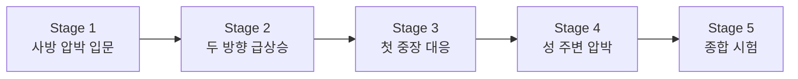

# Stage 1~5 맵 바이블

이 문서는 초반 `Stage 1~5`를 어떤 순서와 의도로 설계할지 정리한 문서다.

목표는 아래 3가지다.

- 플레이어가 성 방어의 기본 구조를 배운다
- 장애물이 적을 돌아오게 만든다는 감각을 익힌다
- Cycle이 늘어날수록 어디가 약한지 읽는 법을 배운다

## 초반 5개 Stage의 큰 방향

- 성 위치는 우선 `중앙 성`을 기본으로 한다
- 초반에는 장애물 밀도를 높게 둔다
- 플레이어가 킬존을 만들 시간을 충분히 확보한다
- Stage 4~5부터는 직선 압박 비중을 조금씩 늘린다

## Stage 1 - 사방 압박 입문

- 목표: 처음부터 사방을 보게 만들되, 장애물 덕분에 읽을 수 있는 초반 긴장감 만들기
- 성 위치: 중앙 성
- 스폰 패턴: 사방 압박형
- 장애물 특징: 각 방향 적이 곧장 성으로 오지 못하고 한 번씩 우회하는 링 구조
- 배워야 할 것: 빠른 시야 분배, 첫 킬존 선택, 성 앞 최종 방어선 확보

## Stage 2 - 두 방향 급상승

- 목표: 사방 압박은 유지하면서 특정 두 방향의 압박이 더 세질 수 있음을 가르치기
- 성 위치: 중앙 성
- 스폰 패턴: 사방 압박형
- 장애물 특징: 두 방향은 긴 우회, 두 방향은 짧은 우회로 차이를 만든다
- 배워야 할 것: 먼저 막아야 할 방향 판단하기

## Stage 3 - 첫 중장 체크

- 목표: 단순 화력만으로는 부족한 상황을 보여주기
- 성 위치: 중앙 성
- 스폰 패턴: 사방 압박형 또는 양방향 강화형
- 장애물 특징: 한쪽은 관문, 한쪽은 넓은 화력 구간
- 배워야 할 것: 병영과 마법사 같은 역할 분리

## Stage 4 - 성 주변 압박 상승

- 목표: 성 앞 최종 방어선의 중요도를 느끼게 하기
- 성 위치: 중앙 성 또는 약한 위쪽 치우침
- 스폰 패턴: 세 방향 조임형 또는 사방 압박형
- 장애물 특징: 바깥 우회는 여전히 있지만 성 근처가 더 위험해진다
- 배워야 할 것: 후퇴 거점과 재배치 감각

## Stage 5 - 초반 구간 종합 시험

- 목표: Stage 1~4에서 배운 모든 것을 한 번에 시험하기
- 성 위치: 중앙 성 또는 위쪽 치우친 성
- 스폰 패턴: 사방 압박형
- 장애물 특징: 한 방향은 긴 우회, 한 방향은 짧은 돌진, 나머지는 보조 압박
- 배워야 할 것: 타워 조합과 우선순위 전환

## Stage 1~5 진행 곡선

## 체크리스트

각 Stage는 아래를 반드시 가져야 한다.

- 무엇을 가르치는지 한 문장으로 설명 가능해야 한다
- 성 위치와 스폰 패턴이 분명해야 한다
- 장애물 역할이 최소 2개 이상 있어야 한다
- 추천 킬존과 후퇴 거점이 보여야 한다
- 마지막 Cycle에서 플레이어 배치 습관을 시험해야 한다

## 다음 작업

다음으로 구체화할 것:

1. Stage 1 좌표 고정
2. Stage 2 좌표 초안
3. Stage 1~5 공통 맵 그리드 규칙 고정
