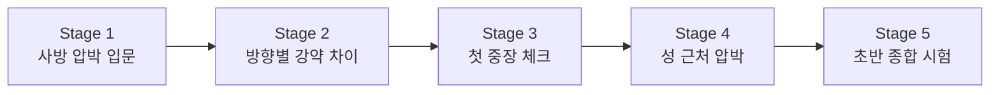

# Stage 1~5 맵 바이블

이 문서는 초반 `Stage 1~5`를 어떤 흐름으로 설계할지 정리한 기준 문서다.

핵심 목표는 아래 세 가지다.

- 플레이어가 중앙 성 방어의 기본 구조를 배운다
- 장애물이 적을 돌아오게 만든다는 감각을 체험한다
- Cycle이 진행될수록 어디가 위험해지는지 읽는 법을 배운다

## 현재 상태

| Stage | 상태 | 핵심 목표 |
| --- | --- | --- |
| Stage 1 | 구현 기준 확정 | 사방 압박 입문, 장애물 우회 이해 |
| Stage 2 | 코드 적용 초안, 플레이 검증 대기 | 방향별 압박 강약 차이 학습 |
| Stage 3 | 코드 적용 초안, 플레이 검증 대기 | 첫 중장 체크 |
| Stage 4 | 코드 적용 초안, 플레이 검증 대기 | 성 근처 최종 방어 압박 |
| Stage 5 | 코드 적용 초안, 플레이 검증 대기 | 초반 규칙 종합 시험 |

## 초반 5개 Stage 공통 방향

- 성 위치는 우선 `중앙 또는 거의 중앙`을 기준으로 쓴다
- 초반에는 장애물 수를 충분히 둬서 적이 돌아오게 만든다
- Stage 1부터 사방 압박을 보여준다
- Stage 2부터는 방향별 압박 강약을 만든다
- 후반으로 갈수록 일부 방향은 직선 압박 비중을 조금씩 늘린다
- Stage 1~5는 `중앙 성 수비의 기본기`를 완성하는 구간으로 본다

## Stage 1 - 사방 압박 입문

- 상태: 구현 기준 확정
- 목표: 첫 판부터 사방 압박을 보여주되, 장애물 덕분에 대응 가능한 긴장감을 만든다
- 성 위치: 중앙
- 스폰 방향: 북 / 동 / 남 / 서 모두 사용
- 장애물 특징:
  - 각 방향 적이 성 직선으로 바로 못 들어온다
  - 북/서는 북서 킬존으로, 동/남은 남동 킬존으로 흐르게 만든다
- 플레이어가 배우는 것:
  - 사방 시야 분산
  - 초반 킬존 만들기
  - 성 바로 앞 방어의 중요성

## Stage 2 - 방향별 압박 강약 차이

- 상태: 코드 적용 초안, 플레이 검증 대기
- 목표: 사방 압박은 유지하되, 모든 방향이 같은 위협은 아니라는 점을 가르친다
- 성 위치: 중앙
- 스폰 방향: 북 / 동 / 남 / 서 모두 사용
- 핵심 변화:
  - 동쪽은 짧은 압박
  - 북쪽은 긴 우회
  - 남쪽은 늦게 몰리는 우회
  - 서쪽은 중간 길이 압박
- 플레이어가 배우는 것:
  - 먼저 막아야 할 방향 판단
  - 같은 타워라도 어느 방향에 세우는지가 중요하다는 점
  - 빠른 압박과 늦은 압박을 동시에 준비하는 법

## Stage 3 - 첫 중장 체크

- 상태: 코드 적용 초안, 플레이 검증 대기
- 목표: 단순 화력만으로는 부족한 상황을 보여준다
- 기본 방향:
  - 사방 압박 유지
  - 한 방향에 첫 중장 적 추가
  - 병영 또는 마법 계열의 필요성을 느끼게 한다
- 플레이어가 배우는 것:
  - 타워 역할 분리
  - 단일 화력과 저지의 균형

## Stage 4 - 성 근처 최종 방어 압박

- 상태: 코드 적용 초안, 플레이 검증 대기
- 목표: 외곽보다 성 근처 최종 방어선의 중요성을 느끼게 한다
- 기본 방향:
  - 일부 외곽 우회는 유지
  - 성 근처 안전 구간은 줄인다
  - 실수했을 때 성 앞에서 한 번 더 막아야 하는 구조를 만든다
- 플레이어가 배우는 것:
  - 후퇴 거점 활용
  - 성 앞 한 칸의 가치

## Stage 5 - 초반 규칙 종합 시험

- 상태: 코드 적용 초안, 플레이 검증 대기
- 목표: Stage 1~4에서 배운 것을 한 번에 시험한다
- 기본 방향:
  - 사방 압박 유지
  - 방향별 우회 길이 차이 유지
  - 마지막 Cycle에서 판단 난도가 올라간다
- 플레이어가 배우는 것:
  - 우선순위 전환
  - 맵 읽기와 배치 판단의 종합

## Stage 1~5 진행 곡선

## 체크리스트

각 Stage는 아래를 반드시 가져야 한다.

- 무엇을 가르치는지 한 문장으로 설명 가능해야 한다
- 성 위치와 스폰 방향이 분명해야 한다
- 장애물의 역할이 최소 2개 이상 있어야 한다
- 추천 킬존과 위험 구역이 보여야 한다
- 마지막 Cycle에서 플레이어 판단이 시험되어야 한다

## 다음 작업

1. Stage 2~5를 실제 플레이로 검증한다.
2. Stage별로 적 수, Cycle 수, 장애물 위치를 필요하면 미세 조정한다.
3. Stage 2~5가 괜찮으면 확정 상태로 바꾼다.
4. Stage 6부터는 성 위치 변경 구간으로 새 작업 카드를 만든다.
