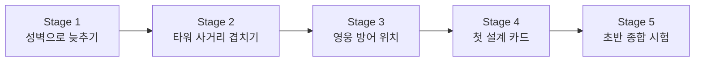

# Stage 1~5 맵 바이블

이 문서는 초반 `Stage 1~5`를 어떤 흐름으로 설계할지 정리한 기준 문서다.

핵심 목표는 아래 세 가지다.

- 플레이어가 성벽으로 적을 늦추는 감각을 배운다
- 타워 사거리를 겹쳐 kill zone을 만드는 법을 체험한다
- Wave가 진행될수록 어디가 위험해지는지 읽는 법을 배운다

## 현재 상태

| Stage | 상태 | 핵심 목표 |
| --- | --- | --- |
| Stage 1 | 구현 기준 확정 | 성벽으로 늦추기 |
| Stage 2 | 구현 기준 확정 | 타워 사거리 겹치기 |
| Stage 3 | 구현 기준 확정 | 영웅 방어 위치와 첫 중장 체크 |
| Stage 4 | 구현 기준 확정 | 첫 설계 카드 |
| Stage 5 | 코드 적용 초안, 플레이 검증 대기 | 초반 규칙 종합 시험 |

## 초반 5개 Stage 공통 방향

- 성 위치는 Stage 1~5에서 `[2,11]`로 고정한다
- Stage 1~3은 주사위 없이 고정 학습 작전으로 진행한다
- Stage 4부터 설계 카드 주사위를 연다
- Stage 5 마지막 Wave에서만 짧은 사방 프리뷰를 허용한다
- Stage 1~5는 `요새 설계가 재미있는지`를 검증하는 구간으로 본다

## Stage 1 - 성벽으로 늦추기

- 상태: 구현 기준 확정
- 목표: 북쪽 적을 성벽으로 늦추고 궁수 사거리 안에서 처리하게 만든다
- 성 위치: `[2,11]`
- 스폰 방향: 북, 마지막 Wave에 북+서
- 플레이어가 배우는 것:
  - 성벽은 단순 체력이 아니라 시간을 사는 도구
  - 궁수 사거리 안으로 적을 오래 묶는 배치

## Stage 2 - 타워 사거리 겹치기

- 상태: 구현 기준 확정
- 목표: 북쪽과 동쪽 압박을 한 kill zone에 묶어 타워 사거리를 겹치게 한다
- 성 위치: `[2,11]`
- 스폰 방향: 북 -> 북+동
- 핵심 변화:
  - 동쪽은 짧은 압박
  - 북쪽은 긴 우회
  - 남쪽은 늦게 몰리는 우회
  - 서쪽은 중간 길이 압박
- 플레이어가 배우는 것:
  - 먼저 막아야 할 방향 판단
  - 같은 타워라도 어느 방향에 세우는지가 중요하다는 점
  - 빠른 압박과 늦은 압박을 동시에 준비하는 법

## Stage 3 - 첫 중장 체크

- 상태: 코드 적용 초안, 플레이 검증 대기
- 목표: 단순 화력만으로는 부족한 상황을 보여준다
- 기본 방향:
  - 사방 압박 유지
  - 한 방향에 첫 중장 적 추가
  - 병영 또는 마법 계열의 필요성을 느끼게 한다
- 플레이어가 배우는 것:
  - 타워 역할 분리
  - 단일 화력과 저지의 균형

## Stage 4 - 첫 설계 카드

- 상태: 구현 기준 확정
- 목표: 첫 설계 카드가 같은 맵의 빌드 방향을 바꾼다는 것을 보여준다
- 기본 방향:
  - Stage 시작 전 1 of 3 설계 카드 선택
  - 북/동/서 3방향 압박
  - 선택한 작전 라인에 맞춘 배치를 유도한다
- 플레이어가 배우는 것:
  - 후퇴 거점 활용
  - 성 앞 한 칸의 가치

## Stage 5 - 초반 규칙 종합 시험

- 상태: 코드 적용 초안, 플레이 검증 대기
- 목표: Stage 1~4에서 배운 것을 한 번에 시험한다
- 기본 방향:
  - 사방 압박 유지
  - 방향별 우회 길이 차이 유지
  - 마지막 Wave에서 판단 난도가 올라간다
- 플레이어가 배우는 것:
  - 우선순위 전환
  - 맵 읽기와 배치 판단의 종합

## Stage 1~5 진행 곡선

## 체크리스트

각 Stage는 아래를 반드시 가져야 한다.

- 무엇을 가르치는지 한 문장으로 설명 가능해야 한다
- 성 위치와 스폰 방향이 분명해야 한다
- 장애물의 역할이 최소 2개 이상 있어야 한다
- 추천 킬존과 위험 구역이 보여야 한다
- 마지막 Wave에서 플레이어 판단이 시험되어야 한다

## 다음 작업

1. Stage 2~5를 실제 플레이로 검증한다.
2. Stage별로 적 수, Wave 수, 장애물 위치를 필요하면 미세 조정한다.
3. Stage 2~5가 괜찮으면 확정 상태로 바꾼다.
4. Stage 6부터는 성 위치 변경 구간으로 새 작업 카드를 만든다.
