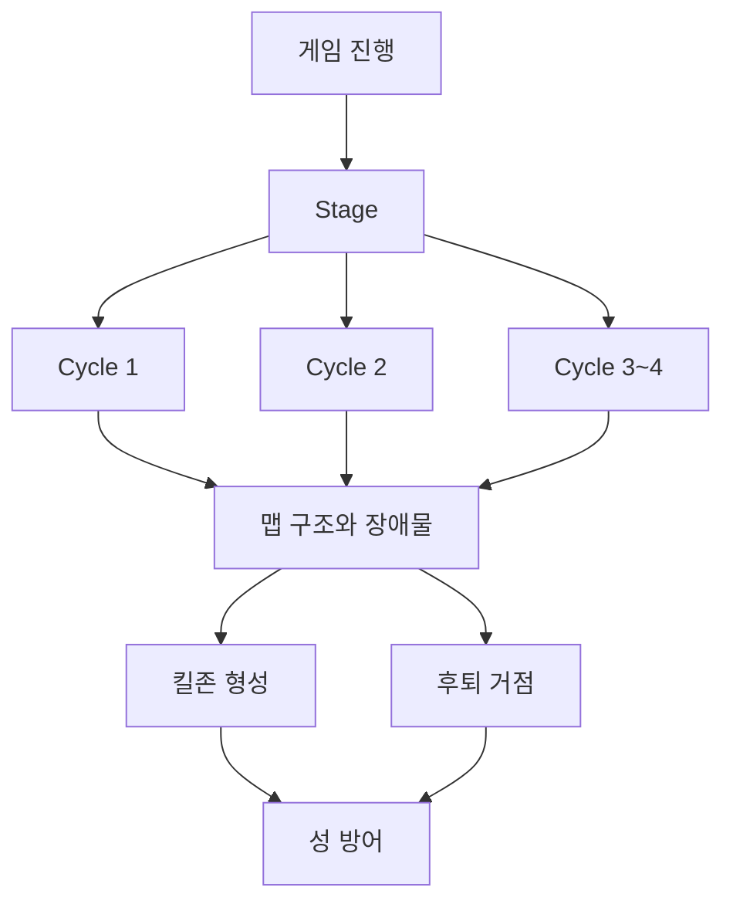
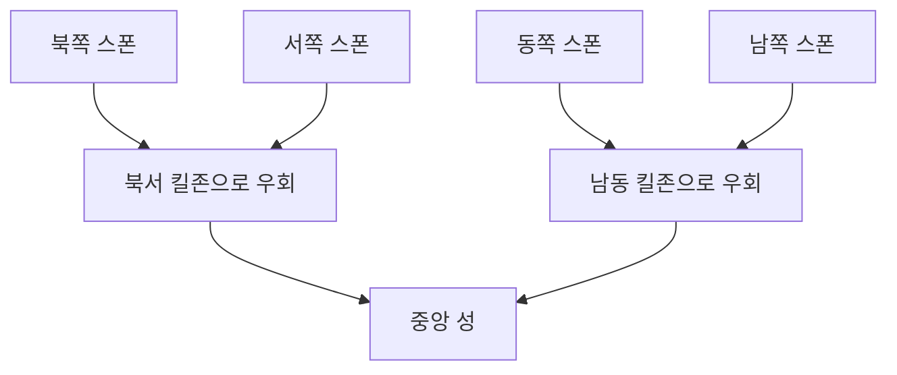
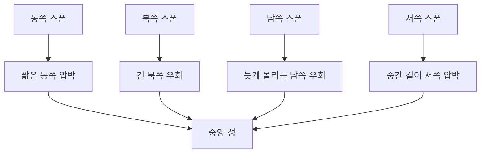
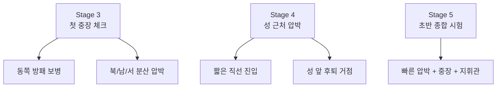

## Current Art Direction Pass

Use the existing Kenney 2D asset folders as the first map-readability pass before generating new art:

- `kenney_tower-defense-top-down`: primary source for readable ground tiles, route marks, blocked edges, and simple top-down battlefield language.
- `kenney_tower-defense`: secondary source for chunky tower-defense landmarks and icon-like props.
- `kenney_tiny-dungeon`: secondary source for wall/gate/interior fragments only when fantasy detail is needed.

Map composition target:

- keep the battlefield clean enough that walls, towers, enemies, and hero guard anchors read first
- use authored build cells near the citadel, route bends, and fallback pockets instead of exposing the full grass field
- mark active routes with subtle path wear, dust, arrows, or edge glow rather than filling the board with heavy roads
- make the citadel a strong first-read landmark, then frame it with an inner ring and outer ring of buildable cells
- use AI-generated bitmap assets only for missing hero/monster/set-piece needs after the existing Kenney and LPC assets fail the readability test

# 맵 시각 가이드

이 문서는 `말로만 읽는 맵 설계`가 아니라, 구조를 빠르게 이해할 수 있게 돕는 시각 가이드다.

현재 단계에서는 아래 3가지를 함께 본다.

- Mermaid 구조도
- ASCII 좌표도
- 좌표 설명 텍스트

## 1. 게임 구조 시각화



## 2. Stage 1 구조 요약



Stage 1 핵심:

- 첫 Stage부터 적은 사방에서 들어온다
- 하지만 4방향 모두 성 직선 진입은 못 하게 막는다
- 장애물이 `압박을 읽을 수 있는 난이도`로 바꿔준다

## 3. Stage 2 구조 요약



Stage 2 핵심:

- 4방향은 계속 열린다
- 동쪽은 가장 짧고 빠른 위협이다
- 북쪽과 남쪽은 길게 돌아오기 때문에 대응 시간이 있다
- 플레이어는 먼저 막을 방향을 선택해야 한다

## 4. Stage 3~5 구조 요약



Stage 3 핵심:

- 동쪽에 방패 보병이 본격적으로 등장한다
- 동쪽은 짧고 강한 압박, 남쪽은 늦게 몰리는 우회 압박이다
- 플레이어가 궁수만으로 버티기보다 병영과 마법사 역할을 의식해야 한다

Stage 4 핵심:

- Stage 1~3보다 우회가 줄고 성 근처 압박이 강해진다
- 성 앞 후퇴 거점이 중요해진다
- 너무 복잡한 길보다 `놓친 적을 마지막으로 막는 느낌`을 우선한다

Stage 5 핵심:

- Stage 1~4에서 배운 판단을 한 번에 시험한다
- 마지막 Cycle에서 동쪽 중장과 남쪽 지휘관을 함께 처리한다
- 초반 중앙 성 구간의 마무리 시험으로 둔다

## 5. Stage 1 ASCII 예시

범례:

- `C` = 성
- `N` = 북쪽 경로
- `W` = 서쪽 경로
- `E` = 동쪽 경로
- `S` = 남쪽 경로
- `X` = 장애물
- `K` = 킬존

```text
row00: . . . . . . N . . . . . . .
row01: . . . . . . N . . . . . . .
row02: . . . . N N N . . . . . . .
row03: . . . . N X X X X . . . . .
row04: . . W W K K N K . . . . . .
row05: . . W X X K N K . X . . . .
row06: W W W X . . C . . X E E E E
row07: . . . X . . C . . X E . . .
row08: . . . . . K S E E E E . . .
row09: . . . . X X X X S S . . . .
row10: . . . . . . . . . . . . . .
row11: . . . . . . . . . S . . . .
row12: . . . . . . . S S S . . . .
row13: . . . . . . . S . . . . . .
```

## 6. Stage 2 ASCII 구현 초안

```text
row00: . . . . . N . . . . . . . .
row01: . . . . . N . . . . . . . .
row02: . . . N N N . . . . . . . .
row03: . . . N . X X X . . . . . .
row04: . . . N K K N . . . . . . .
row05: . . . X . K N . . X X . . .
row06: . . . X . . C E E E E E E E
row07: W W W W . . C S . X X . . .
row08: . . . W W W W S . . . . . .
row09: . . . . . X X S X X . . . .
row10: . . . . . . . S S S S . . .
row11: . . . . . . . . . . S . . .
row12: . . . . . . . . S S S . . .
row13: . . . . . . . . S . . . . .
```

Stage 2 ASCII 해석:

- 동쪽 `E` 경로는 가장 짧다
- 북쪽 `N` 경로는 왼쪽으로 꺾여 긴 우회를 만든다
- 남쪽 `S` 경로는 오른쪽으로 돌아 늦게 도착한다
- 서쪽 `W` 경로는 중간 길이로 압박한다
- `K`는 북서 보조 킬존이며, 동쪽은 성 오른쪽에서 별도 우선 대응이 필요하다

## 7. Stage 3 ASCII 구현 초안

```text
row00: . . . . . . . N . . . . . .
row01: . . . . . . . N . . . . . .
row02: . . . . . . X N X . . . . .
row03: . . . . . N N N . . . . . .
row04: . . . . . N . . . . . . . .
row05: W W W W W W C . . . . . . .
row06: . . . X X . C . . X X . . .
row07: . . . . . . C E E E E E E E
row08: . . . . . . . . . X X . . .
row09: . . . S S S S . . . . . . .
row10: . . . S . X X X . . . . . .
row11: . . . S S S . . . . . . . .
row12: . . . . . S . . . . . . . .
row13: . . . . . S . . . . . . . .
```

Stage 3 ASCII 해석:

- 동쪽 `E`는 방패 보병이 들어오는 핵심 위험선이다
- 남쪽 `S`는 길게 돌아 늦게 합류한다
- 서쪽 `W`는 빠른 주의 분산 역할을 한다

## 8. Stage 4 ASCII 구현 초안

```text
row00: . . . . . . N . . . . . . .
row01: . . . . . . N . . . . . . .
row02: . . . . . . N . . . . . . .
row03: . . . . . . N . . . . . . .
row04: . . . . X . N . X . . . . .
row05: . . . . . X N X . . . . . .
row06: W W W W W W C E E E E E E E
row07: . . . . . X S X . . . . . .
row08: . . . . X . S . X . . . . .
row09: . . . . . . S . . . . . . .
row10: . . . . . . S . . . . . . .
row11: . . . . . . S . . . . . . .
row12: . . . . . . S . . . . . . .
row13: . . . . . . S . . . . . . .
```

Stage 4 ASCII 해석:

- 사방 경로가 짧아져 성 근처 압박이 강해진다
- `X`는 길을 길게 돌리기보다 배치 공간을 압축하는 역할이다
- 외곽에서 놓친 적을 성 앞에서 마지막으로 막는 Stage다

## 9. Stage 5 ASCII 구현 초안

```text
row00: . . . . . . N . . . . . . .
row01: . . . . . . N . . . . . . .
row02: . . . . N N N X X . . . . .
row03: . . . . N X X X X . . . . .
row04: . . . . N N N . . . . . . .
row05: . . . . . . N E . . E E E E
row06: . . . X W W C E E E E . . .
row07: . . . X W . C . . . X X . .
row08: W W W W W . S . . . . . . .
row09: . . . . . X S X X . . . . .
row10: . . . . . . S S S S . . . .
row11: . . . . . . . . . S . . . .
row12: . . . . . . . S S S . . . .
row13: . . . . . . . S . . . . . .
```

Stage 5 ASCII 해석:

- 동쪽 `E`는 중장 압박, 남쪽 `S`는 지휘관이 섞이는 후반 압박이다
- 북쪽과 서쪽은 플레이어의 시선을 흔드는 분산 압박이다
- 초반 중앙 성 구간을 마무리하는 종합 시험이다

## 10. Stage 6 ASCII 구현 초안

```text
row00: . . . . . . . N . . . . . .
row01: . . . . . . . N N N . . . .
row02: . . . . . . . N N N . . . .
row03: . . . . . . . N X X . . . .
row04: . . . . . . . N . X X . . .
row05: . . . . X W W C E E E E E E
row06: . . . W W W . . . . X X . .
row07: W W W W X . . S . . X . . .
row08: . . . . . X X S S X . . . .
row09: . . . . . . . . S . . . . .
row10: . . . . S S S S S . . . . .
row11: . . . . S . . . . . . . . .
row12: . . . . S S S . . . . . . .
row13: . . . . . . S . . . . . . .
```

Stage 6 ASCII 해석:

- 성 `C`가 처음으로 중앙 `[6,6]`을 벗어나 `[7,5]`로 이동한다
- 동쪽 `E`와 북쪽 `N`은 짧고 빠른 위험 방향이다
- 남쪽 `S`와 서쪽 `W`는 길게 돌아와 하단 킬존을 만들 시간을 준다
- Stage 6부터는 성 좌표가 데이터로 관리되어야 한다

## 11. 전선 화살표 기준

- 파란색: 북쪽 전선
- 초록색: 동쪽 전선
- 빨간색: 남쪽 전선
- 노란색: 서쪽 전선

중요한 기준:

- 화살표는 `개별 적의 정확한 스폰 위치`를 따라다니지 않는다
- 화살표는 현재 열린 방향을 알려주는 `대표 UI`다
- 실제 적은 같은 변 내부에서 랜덤 위치로 등장한다
- 북쪽 화살표는 HUD와 겹치지 않도록 전장 안쪽에 둔다

## 12. 도움말 배너 기준

- HUD 바로 아래에 붙어 있는 느낌으로 배치한다
- 글 길이에 따라 1줄 또는 2줄로 유동적으로 보여준다
- 너무 긴 문구는 화면용으로 조금 줄여서 사용한다
- 전투 중에도 전장을 크게 가리지 않아야 한다

## 13. 문서와 실제 구현의 관계

문서의 ASCII와 Mermaid는 `실제 화면을 그대로 복사하는 그림`이 아니다.

대신 아래를 빠르게 읽게 해주는 구조 설명도다.

- 성이 어디에 있는가
- 적이 어디서 들어오는가
- 장애물이 어디에서 우회를 만드는가
- 플레이어가 어디에 킬존을 만들게 되는가

즉, 실제 게임 화면은 아트와 배치 언어로 표현되고, 문서는 그 아래에 있는 구조 논리를 고정하는 역할을 한다.
