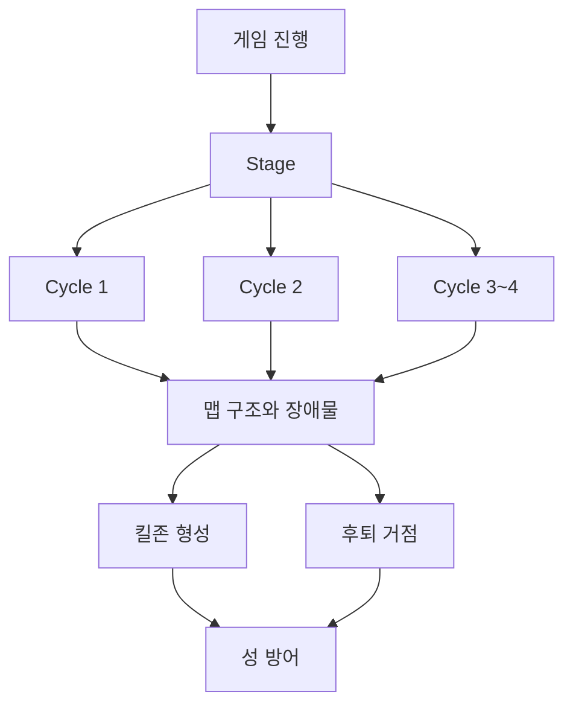
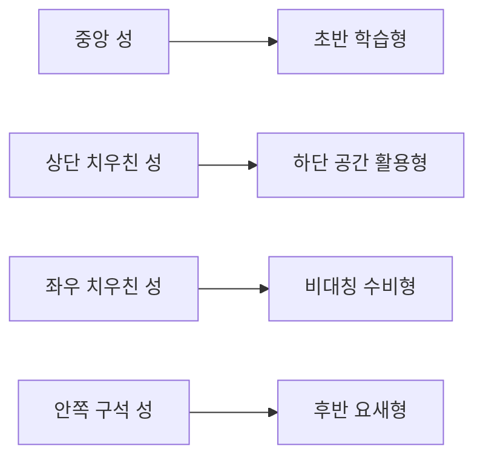
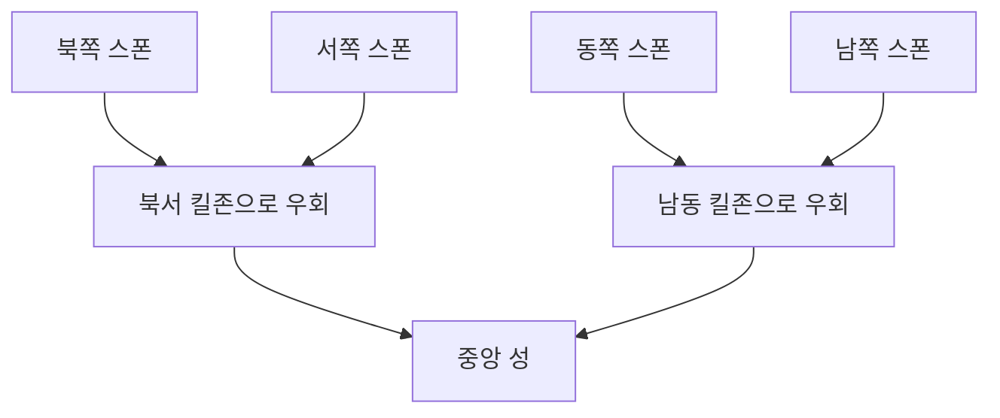
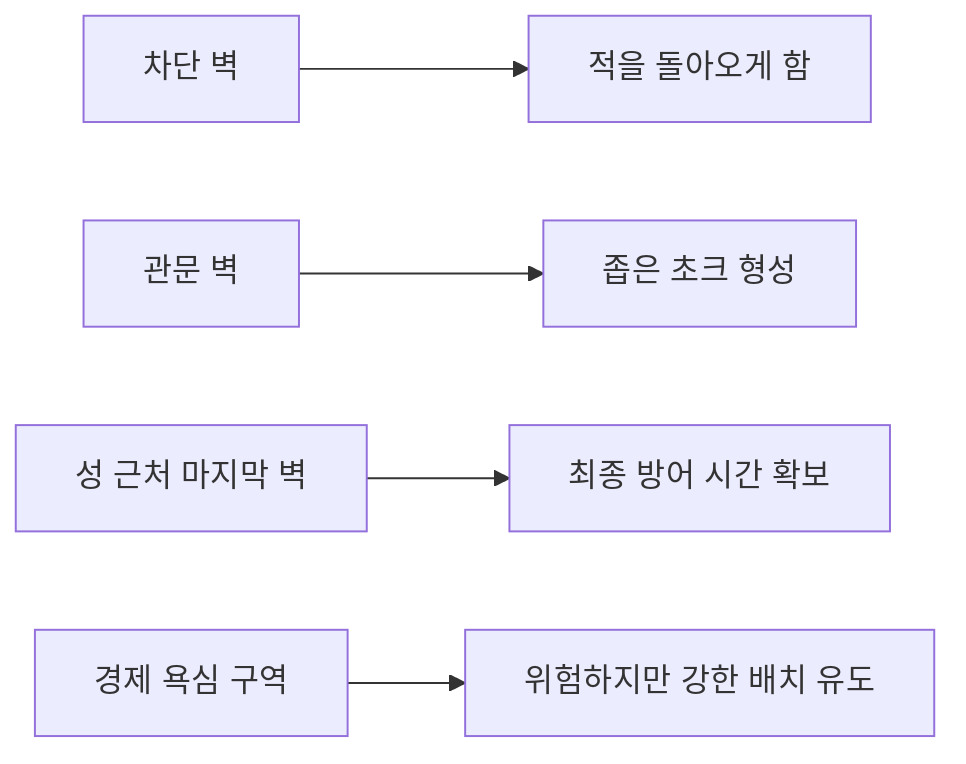

# 맵 시각 가이드

이 문서는 `말로만 읽는 맵 설계`가 아니라, 구조를 빠르게 이해할 수 있게 돕는 시각 가이드다.

지금 단계에서는 아래 3가지를 함께 본다.

- Mermaid 구조도
- ASCII 좌표도
- 좌표 설명 텍스트

필요하면 이후에는 Stage별 PNG 미리보기까지 추가할 수 있지만, 현재는 `mermaid + ASCII + 좌표` 조합이 가장 관리하기 쉽다.

## 1. 게임 구조 시각화



## 2. 성 위치 패턴 예시



## 3. Stage 1 구조 요약



Stage 1에서 중요한 점은 단순하다.

- 첫 Stage부터 적은 사방에서 들어온다
- 하지만 4방향 모두 성 직선 진입은 못 하게 막는다
- 장애물이 `압박을 읽을 수 있는 난이도`로 바꿔줘야 한다

## 4. Stage 1 ASCII 예시

범례

- `C` = 성
- `N` = 북쪽 경로
- `W` = 서쪽 경로
- `E` = 동쪽 경로
- `S` = 남쪽 경로
- `X` = 장애물
- `K` = 킬존

```text
row00: . . . . . . N . . . . . . .
row01: . . . . . . N . . . . . . .
row02: . . . . N N N . . . . . . .
row03: . . . . N X X X X . . . . .
row04: . . W W K K N K . . . . . .
row05: . . W X X K N K . X . . . .
row06: W W W X . . C . . X E E E E
row07: . . . X . . C . . X E . . .
row08: . . . . . K S E E E E . . .
row09: . . . . X X X X S S . . . .
row10: . . . . . . . . . . . . . .
row11: . . . . . . . . . S . . . .
row12: . . . . . . . S S S . . . .
row13: . . . . . . . S . . . . . .
```

## 5. 장애물 역할 예시



Stage 1에서 특히 중요한 것은 아래 세 가지다.

- 4방향이 모두 열려 있어야 한다
- 4방향이 모두 직선 돌진이면 안 된다
- 장애물이 `사방 압박을 읽을 수 있는 난이도`를 만들어야 한다

## 6. 전선 화살표 기준

Stage 1 기준 전선 화살표는 아래처럼 해석한다.

- 파란색: 북쪽 전선
- 초록색: 동쪽 전선
- 빨간색: 남쪽 전선
- 노란색: 서쪽 전선

중요한 기준:

- 화살표는 `개별 적의 정확한 스폰 위치`를 따라다니지 않는다
- 화살표는 현재 열린 방향을 알려주는 `대표 UI`다
- 실제 적은 같은 변 내부에서 랜덤 위치로 등장한다
- 북쪽 화살표는 HUD와 겹치지 않도록 전장 안쪽에 둔다

## 7. 도움말 배너 기준

현재 Stage 1 기준 도움말 배너는 아래 원칙을 따른다.

- HUD 바로 아래에 붙어 있는 느낌으로 배치한다
- 글 길이에 따라 1줄 또는 2줄로 유동적으로 보여준다
- 너무 긴 문구는 화면용으로 조금 줄여서 사용한다
- 전투 중에도 전장을 크게 가리지 않아야 한다

## 8. 문서와 실제 구현의 관계

문서의 ASCII와 Mermaid는 `실제 화면을 그대로 복사하는 그림`이 아니다.

대신 아래를 빠르게 읽게 해주는 구조 설명도다.

- 성이 어디에 있는가
- 적이 어디서 들어오는가
- 장애물이 어디에서 우회를 만드는가
- 플레이어가 어디에 킬존을 만들게 되는가

즉, 실제 게임 화면은 아트와 배치 언어로 표현되고, 문서는 그 아래에 있는 구조 논리를 고정하는 역할을 한다.
