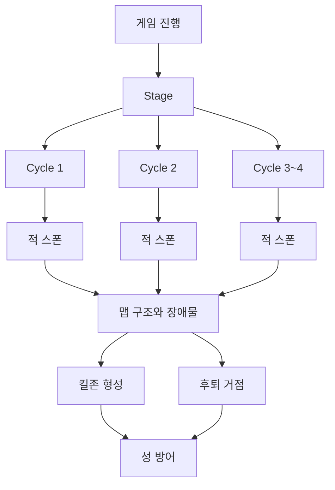
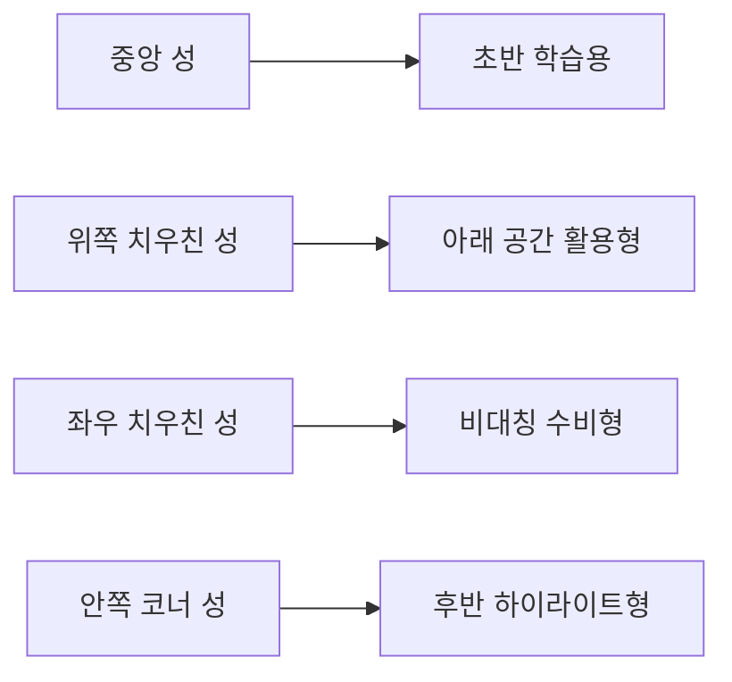
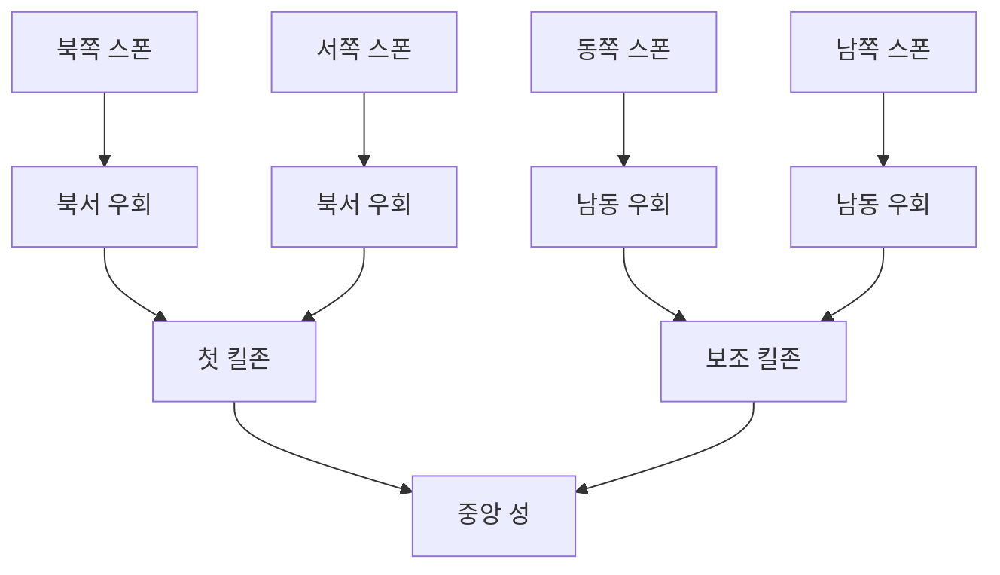
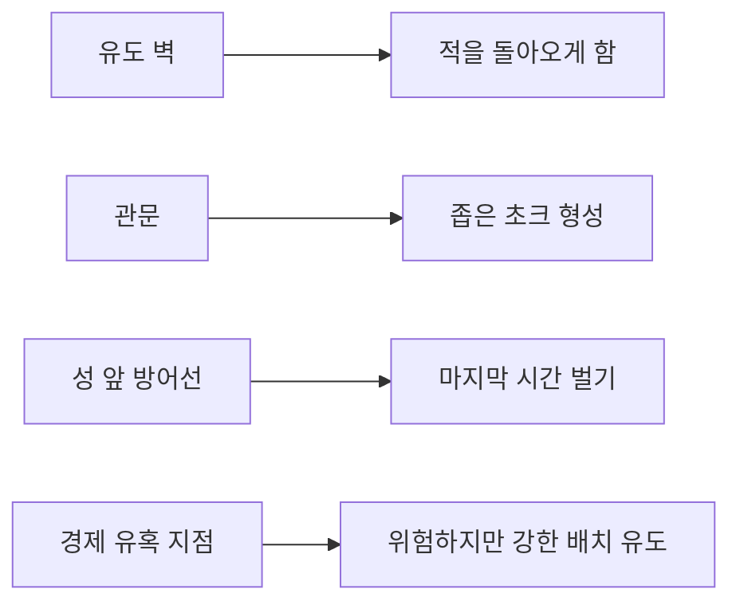

# 맵 시각 가이드

이 문서는 `말로만 읽는 맵 설계`가 아니라, 눈으로 구조를 빨리 이해할 수 있도록 만든 시각 가이드다.

실제 맵 작업에서는 아래 3가지를 같이 본다.

- 다이어그램
- ASCII 좌표도
- 셀 좌표 목록

필요하면 이후에 Stage별 PNG 미리보기까지 추가할 수 있지만, 지금 단계에서는 문서 버전 관리가 쉬운 `mermaid + ASCII`가 가장 효율적이다.

## 1. 게임 구조 시각화



## 2. 성 위치 패턴 예시



## 3. Stage 1 전장 읽기 예시



이 구조가 뜻하는 것은 단순하다.

- Stage 1부터 적은 사방에서 들어온다
- 하지만 각 방향 적은 장애물 때문에 곧장 성으로 못 들어온다
- 북/서는 같은 북서 킬존으로, 동/남은 같은 남동 킬존으로 모이게 설계한다
- 그래서 초반부터 바쁘지만, 완전히 억울한 난이도는 아니게 만든다

현재 구현 기준으로 보면 이 그림은 `완전한 스크린샷 복제도`가 아니라 `구조 설명도`다.

- 스크린샷에서는 성 주변에 성벽 청크가 사각 링처럼 배치된다
- 외곽에는 표지판, 우물, 울타리, 마차, 상자 같은 외곽 프롭이 놓인다
- 적은 각 변에서 랜덤 위치로 나타나지만, 전선은 북/동/남/서 4방향으로 읽힌다

## 4. Stage 1 ASCII 예시

```text
범례
C = 성
N = 북쪽 경로
W = 서쪽 경로
E = 동쪽 경로
S = 남쪽 경로
X = 장애물
K = 킬존

row00: . . . . . . N . . . . . . .
row01: . . . . . . N . . . . . . .
row02: . . . . N N N . . . . . . .
row03: . . . . N X X X X . . . . .
row04: . . W W K K N K . . . . . .
row05: . . W X X K N K . X . . . .
row06: W W W X . . C . . X E E E E
row07: . . . X . . C . . X E . . .
row08: . . . . . K S E E E E . . .
row09: . . . . X X X X S S . . . .
row10: . . . . . . . . . . . . . .
row11: . . . . . . . . . S . . . .
row12: . . . . . . . S S S . . . .
row13: . . . . . . . S . . . . . .
```

## 5. 장애물 역할 예시



Stage 1에서 특히 중요한 것은 아래 세 가지다.

- 처음부터 네 방향 모두 열려 있어야 한다
- 하지만 네 방향 모두 직선 돌진은 못 하게 막아야 한다
- 장애물이 `사방 압박을 읽을 수 있는 난이도`로 바꿔줘야 한다

## 6. 전선 화살표 결정

Stage 1 기준 화살표는 아래처럼 해석한다.

- 파란색: 북쪽 전선
- 초록색: 동쪽 전선
- 빨간색: 남쪽 전선
- 노란색: 서쪽 전선

중요한 결정:

- 화살표는 `개별 적의 정확한 스폰 위치`를 따라다니지 않는다
- 화살표는 지금 열려 있는 전선을 알려주는 `대표 UI`로 유지한다
- 대신 실제 적 생성은 같은 변 안에서 랜덤 위치로 발생할 수 있다

이유:

- 화살표가 적이 생성될 때마다 움직이면 시선이 흔들리고 읽기 어려워진다
- 플레이어는 "어느 적이 어디서 정확히 나왔는지"보다 "지금 어느 전선이 위험한지"를 먼저 알아야 한다
- 실제 생성 위치 정보가 더 필요하면 짧은 스폰 링/플래시 이펙트를 별도로 쓰는 편이 낫다

추가 규칙:

- 북쪽 화살표는 HUD 바로 밑 0px 경계가 아니라, 전장 안쪽 안전 여백으로 내려야 한다
- 상단 UI와 겹치는 경우는 잘못된 배치로 본다

## 7. 지금 문서 단계에서 이미지가 왜 필요한가

맵 설계는 수치만으로 보면 감이 잘 안 온다.
그래서 문서 단계에서도 시각 자료가 꼭 필요하다.

현재는 아래 순서로 시각화한다.

1. Mermaid로 전장 흐름을 먼저 잡는다
2. ASCII로 셀 구조를 빠르게 본다
3. 좌표 리스트로 구현용 데이터를 고정한다
4. 나중에 필요하면 Stage 미리보기 PNG를 추가한다

즉, 지금은 `이미지 없는 문서`가 아니라 `문서 안에서 바로 읽히는 시각화`를 먼저 만드는 단계다.
